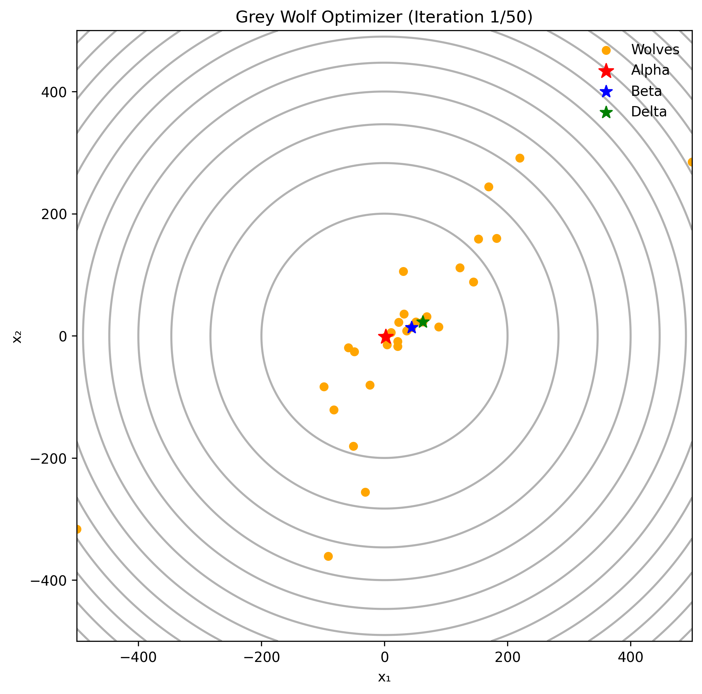
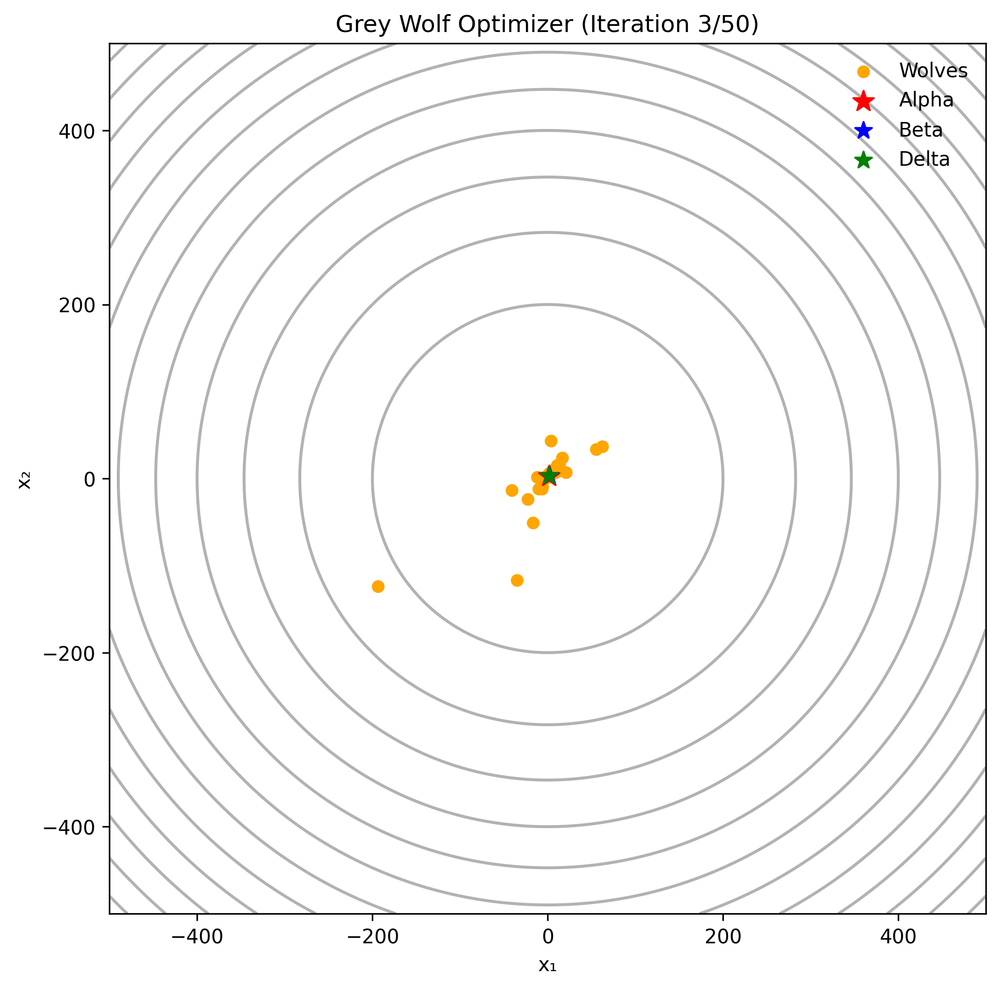
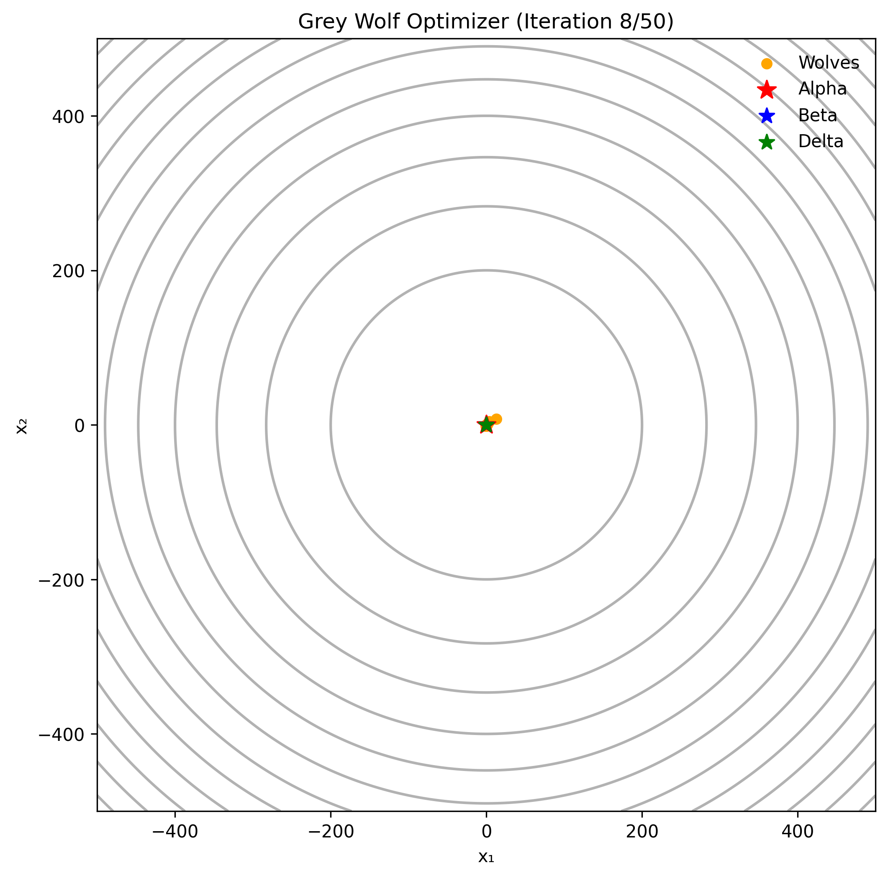

# Grey Wolf Optimization (GWO) Visualization - Group 13

**Project Demo: Mô phỏng trực quan Thuật toán Tối ưu hóa Bầy Sói (GWO)**

**Đề tài:** Tìm hiểu và cài đặt thuật toán GWO cùng các biến thể.

## 1. Giới thiệu (Introduction)

Dự án này là phần thực nghiệm mô phỏng thuộc báo cáo bài tập lớn của **Nhóm 13**. Chúng tôi xây dựng chương trình trực quan hóa hành vi săn mồi của bầy sói trên không gian tìm kiếm liên tục.

Khác với các cài đặt thông thường chỉ xuất ra kết quả số, dự án này sử dụng thư viện `matplotlib` để tạo **Animation (Hoạt ảnh)**, giúp người xem dễ dàng quan sát cách các con sói (Alpha, Beta, Delta, Omega) bao vây và hội tụ về phía con mồi qua từng vòng lặp.

### Thông tin nhóm thực hiện (Team Members)
| STT | Họ và tên | MSSV | Vai trò |
|:---:|:---|:---:|:---|
| 1 | **Nguyễn Việt Anh** | 20235651 | Nghiên cứu biến thể & Viết báo cáo |
| 2 | **Hoàng Văn Bình** | 20235664 | Nghiên cứu lý thuyết & Code Demo |

---

## 2. Chi tiết thuật toán (Algorithm Implementation)

Mã nguồn được cài đặt bám sát mô hình toán học của GWO gốc (Continuous GWO):

* **Cơ chế phân cấp:**
    * ⭐ **Alpha (Màu đỏ):** Lời giải tốt nhất.
    * ⭐ **Beta (Màu xanh dương):** Lời giải tốt thứ 2.
    * ⭐ **Delta (Màu xanh lá):** Lời giải tốt thứ 3.
    * 🟠 **Omega (Màu cam):** Các cá thể còn lại.

* **Quy tắc cập nhật vị trí:**
    Vị trí mới của mỗi con sói được tính dựa trên trung bình cộng vectơ hướng dẫn từ 3 con đầu đàn:
    $$\vec{X}(t+1) = \frac{\vec{X}_1 + \vec{X}_2 + \vec{X}_3}{3}$$

* **Bài toán Demo:** Hàm Sphere (Hàm cầu).
    * Công thức: $f(x) = \sum x_i^2$
    * Mục tiêu: Tìm cực tiểu toàn cục tại tọa độ $(0,0)$.
    * Không gian tìm kiếm: $[-500, 500]$.

---

## 3. Cài đặt và Sử dụng (Installation & Usage)

Để chạy được mô phỏng này, máy tính cần cài đặt Python và các thư viện hỗ trợ đồ họa.

### Bước 1: Clone dự án
```bash
git clone [https://github.com/username-cua-ban/GWO-Visualization-Group13.git](https://github.com/username-cua-ban/GWO-Visualization-Group13.git)
cd GWO-Visualization-Group13

```

### Bước 2: Cài đặt thư việnDự án yêu cầu `numpy` để tính toán ma trận và `matplotlib` để render hình ảnh động.

```bash
pip install numpy matplotlib

```

### Bước 3: Chạy chương trình
```bash
python gwo_demo.py

```

*(Lưu ý: Thay `gwo_demo.py` bằng tên file code thực tế của bạn)*

---

## 4. Kết quả Mô phỏng (Demo Result)Sau khi chạy, chương trình sẽ hiển thị cửa sổ đồ thị động và tự động lưu các khung hình vào thư mục `frames/`.
Dưới đây là hình ảnh trực quan hóa quá trình săn mồi của bầy sói qua các vòng lặp, tương ứng với các giai đoạn tìm kiếm của thuật toán.

### Chi tiết từng giai đoạn (Step-by-Step Analysis)

Chúng tôi chia quá trình hội tụ thành 3 giai đoạn chính:

### 1. Giai đoạn Khởi tạo & Thăm dò 
Ở giai đoạn đầu, các cá thể sói (chấm cam) phân bố ngẫu nhiên khắp không gian tìm kiếm. Hệ số $a$ còn lớn ($\approx 2$), thuật toán ưu tiên quá trình **Khám phá (Exploration)** để tìm kiếm các vùng tiềm năng



### 2. Giai đoạn Bao vây 
Các con sói đầu đàn (Alpha - Đỏ, Beta - Xanh Dương, Delta - Xanh Lá) đã định vị được khu vực có lời giải tốt. Bầy sói bắt đầu di chuyển co cụm lại, hình thành vòng vây quanh tâm 



### 3. Giai đoạn Khai thác & Hội tụ 
Tại vòng lặp cuối, hệ số $a$ giảm về 0. Toàn bộ bầy đàn tập trung dày đặc tại vị trí cực tiểu toàn cục $(0,0)$. Quá trình **Khai thác (Exploitation)** hoàn tất, tìm ra nghiệm chính xác của hàm Sphere

